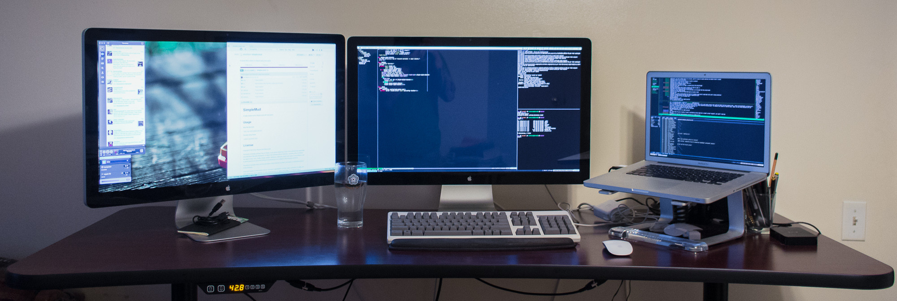

# Local Setup Instructions

We explain which operating system to pick and why. Also, how to setup your desk for maximum data science productivity.

## Table of Contents
[1. Case for Mac over Windows](#section-a)

[2. Desk Setup](#section-b)

---

### 1.  Case for Mac over Windows

**If you program regularly on a Windows or Linux computer, feel free to skip this section. Some of your fellow students are fairly new to programming and local development environments.**

**Most people use Macs. They *are* expensive, but they work really well and they have a Linux-similar operating system that lets you just get down to business.  That way, you can spend more time on data science and less time trouble-shooting.**

**The bootcamp is intense.  Spending time wrestling with compatibility stuff you really don't have to has a high opportunity cost.**

Many Windows users aren’t used to using their computers in the full range of ways that are necessary. In summary, we find that things are more difficult to set up on Windows, and Windows users are less comfortable setting up even simple things. This common combination leads to large productivity hurdles and setbacks. On top of this, it's common for productive data scientists to not use Windows, and in particular the staff and mentors at K2 **does not** and **should not** spend their time troubleshooting Windows issues.

Specific Examples (of what's more difficult on Windows):
* setting PATH
* installing common packages
* installing a compiler toolchain
* accessing compressed files
* downloading remote files
* using X windows
* writing shell scripts
* scheduling tasks

Windows is discouraged, but some people are actually productive on Windows. It’s like an evolutionary disadvantage; if you’re successful anyway it sometimes means your other traits are quite good.  If you really want to run Windows, maybe you should. But we don’t like to put students in a position where we can’t help them, and **we don’t support Windows.**

If you want to spend time learning how to configure things, I recommend learning how to configure Linux over learning how to configure Windows.

### Running Windows - Don't Do It

**Q:  Can I run Windows for the bootcamp, instead of Unix or Linux?**

A: The short answer is this: **Don't run Windows.**

The slightly longer answer is that it is possible to run Windows, but everything is harder. We had a student start the class with Windows, but by the second week that student went out and bought a new computer because it was too hard to keep up in Windows.

### If not Mac, if not Windows, then ---> Linux

You don't necessarily need to buy a new computer. Here are some alternatives:

 * **Linux Virtual Machine:**  If your computer is fairly powerful, you could run a Linux Virtual Machine inside your normal Windows install. This requires some configuration, but at least you end up with a working Linux instead of having to try to make Windows do things.
 * **Install Linux on your computer instead of or alongside Windows:**  Then you can boot to Linux instead of booting to Windows. Again, there is a good deal of configuration to be done to get this to work well, in general. We've had a couple people do the class with Linux this way.

----

## 2. Desk Setup

You should have at least 2 screens. At the bare minimum, a laptop and a large, high-resolution monitor. As close as you can get to the above setup will allow you to achieve maximum efficiency as a data science student. It may seem excessive, but when you are learning data science, you will have an IDE open or a Jupyter Notebook, your terminal, our online learning platform, a web page about module documentation or further background about an algorithm. The less time you spend dragging your mouse and switching between windows means the more time you have to learn and write code.

**Ideal Setup**
- Laptop on a Stand
- 2 External High-Resolution Monitors
- A Raised Keyboard
- A Wired/Wireless Mouse
- A Long Sturdy Desk

*Research on Productivity:*

[Monitor Size and Aspect Ratio Productivity Research](http://www.itjungle.com/tfh/utahdisplaystudy.pdf)

[Laptops and Business Use - A Study on Mice and Keyboards](https://www.bakkerelkhuizen.com/uploads/wysiwyg/BakkerElkhuizen_whitepaper_work%20comfortably%20with%20laptop_%20USv1.pdf)
