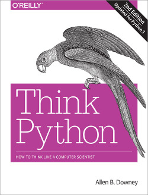

# Python Programming

A complete review of the Python language from introductory to advanced topics.

## Table of Contents
[1. Course Options](#section-a)

[2. Assignments](#section-b)

[3. Projects](#section-c)

---

### 1. Course Options

#### Option 1

[Think Python](http://greenteapress.com/wp/think-python-2e/) is an introduction to Python programming for beginners. It starts with basic concepts of programming, and is carefully designed to define all terms when they are first used and to develop each new concept in a logical progression. Larger pieces, like recursion and object-oriented programming are divided into a sequence of smaller steps and introduced over the course of several chapters.

It is available as a [downloadable PDF](http://greenteapress.com/thinkpython2/thinkpython2.pdf) or you can browse the [online HTML version](http://greenteapress.com/thinkpython2/html/index.html). Several example programs and solutions to some exercises are located in [this GitHub repository](https://github.com/AllenDowney/ThinkPython2/tree/master/code).

Read the entire book. Complete the 1st exercise at the end of each chapter. The rest are optional, but highly recommended. If you get stuck, review the solution code on the GitHub repository. The "case study" chapters are optional, but highly recommended.

#### Option 2

Carnegie Mellon Open Learning Initiative - [Principles of Computing with Python](https://oli.cmu.edu/courses/free-open/computing-course-details/).

The course is free and self-paced. This course does not cover object-oriented programming, so be sure to [review it](https://jeffknupp.com/blog/2014/06/18/improve-your-python-python-classes-and-object-oriented-programming/).

#### Option 3

Zed A. Shaw - [Learn Python the Hard Way](https://learncodethehardway.org/python/).

A step-by-step tutorial for total beginners to learn Pyhton. The online version is free and the tutorial is self-paced.

---

### 2. Assignments

1. Complete 1 of the course options.

---

### 3. Projects

Create the following in Python. Try different programming paradigms, such as procedural and object-oriented.

1. Pig Latin Translator
2. Sieve of Eratosthenes
3. Collatz Conjecture
4. Reverse Polish Notation Calculator
5. Blackjack Game
