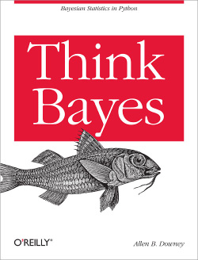

# Bayesian Statistics

## Table of Contents
[1. Think Bayes](#section-a)

[2. Assignments](#section-b)

---

### 1. Think Bayes

[Think Bayes](http://greenteapress.com/wp/think-bayes/) is an introduction to Bayesian statistics using computational methods.

The premise of this book, and the other books in the Think X series, is that if you know how to program, you can use that skill to learn other topics.

Most books on Bayesian statistics use mathematical notation and present ideas in terms of mathematical concepts like calculus. This book uses Python code instead of math, and discrete approximations instead of continuous mathematics. As a result, what would be an integral in a math book becomes a summation, and most operations on probability distributions are simple loops.

The book starts with the introductory concepts and progressing all the way towards advanced contructs. It is available as a [downloadable PDF](http://www.greenteapress.com/thinkbayes/thinkbayes.pdf) or you can browse the [online HTML version](http://www.greenteapress.com/thinkbayes/html/index.html). Several example programs and solutions to some exercises are located in [this GitHub repository](https://github.com/AllenDowney/ThinkBayes).

---

### 2. Assignments

1. Complete the entire book and all the exercises. If you get stuck, review the solution code on the GitHub repository.
