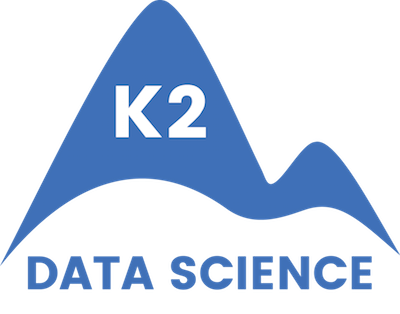

# [K2](http://www.k2datascience.com/) Foundations Program

# Table of Contents

[1. Foundations Program](#section-a)

[2. Submitting Work](#section-b)

[3. Questions](#section-c)

---

## 1.  Foundations Program

The Foundations program is a curated list of books, tutorials and other resources with assignments and projects. These materials are designed to ensure you are ready to succeed in our data science bootcamp. Depending on your background, the program can take anywhere from 30-100+ hours to complete.

**Getting Started**
  - [Local Setup](content/0-local-setup.md)
  - [Development Environment](content/0-environment.md)
  - [General Tips](content/0-general-tips.md)
  - Read [Doing Data Science](https://medium.com/@rchang/my-two-year-journey-as-a-data-scientist-at-twitter-f0c13298aee6#.qfovgm9ps)

**Phase 1**
  - [Introduction to Computer Science](content/1-intro-cs.md)
  - [Python Language Review](content/1-python.md)
  - (Optional) [Advanced CS Concepts](content/1-cs-concepts.md)

**Phase 2**
  - [SQL Databases and APIs](content/2-sql-api.md)
  - [NoSQL Databases and Web Scraping](content/2-nosql-scraping.md)
  - (Optional) [Web Development](content/2-flask.md)

**Phase 3**
 - [Statistics & Probability](content/3-statistics-probability.md)
 - (Optional) [Bayesian Analysis](content/4-bayesian-analysis.md)

**Phase 4**
 - [Linear Algebra](content/3-linear-algebra.md)
 - [Multivariable Calculus](content/4-calculus.md)
 - (Optional) [Optimization Theory](content/4-optimization-theory.md)

**[Recorded Office Hours and Solutions](/content/5-office-hours.md)**

---

## 2. Submitting Work

Once you have completed all the content in Week 0, you should understand how to use Git/GitHub. These are the steps you should follow to submit work:

1. Create a local Git repository called "foundations"
2. Complete assignments and projects
3. Commit changes to the local repository and push them to an online GitHub repository
4. A TA will check your work weekly and give feedback when necessary

---

## 3. Questions

If anything is unclear or you get stuck, [please reach out immediately](<mailto:hello@k2datascience.com>). The program was created by data scientists and machine learning engineers. We have a biased view of which concepts should be learned in which order. We have tried to put ourselves in your shoes, but there is always room for improvement!
